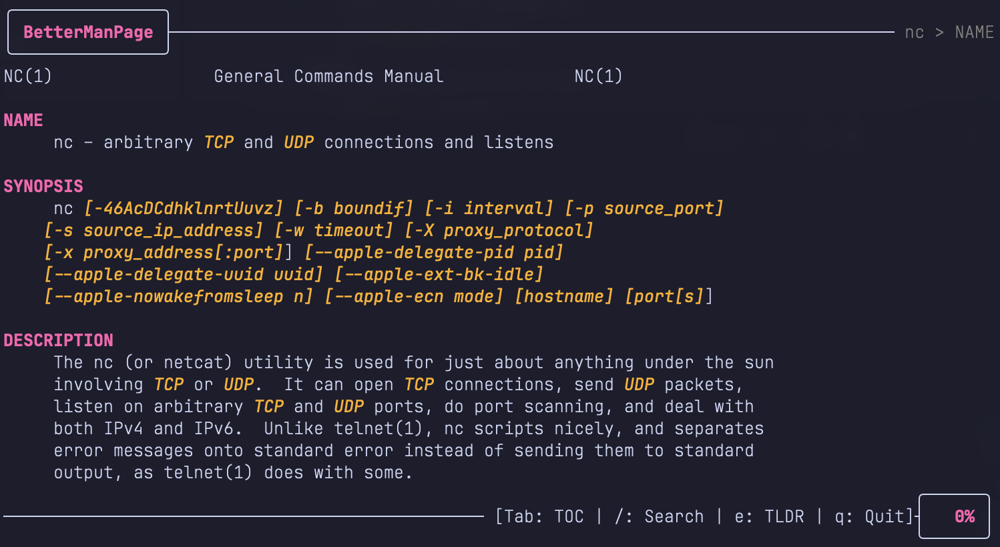

# BetterManPage (bman)

A lightweight, modern CLI utility in Go to enhance the reading experience of Unix `man` pages. It acts as a wrapper around the system `man` command, providing syntax highlighting, easy navigation, and search capabilities within a terminal user interface (TUI).



## Features

- **Modern TUI:** Clean interface built with [Bubble Tea](https://github.com/charmbracelet/bubbletea) and [Lipgloss](https://github.com/charmbracelet/lipgloss) using a **Catppuccin Macchiato** inspired color palette.
- **Robust Troff Parsing:** Correctly interprets original manual formatting (bold and underline) while adding semantic syntax highlighting for flags, paths, URLs, and strings.
- **Section Navigation (TOC):** A toggleable sidebar to quickly jump between standard sections like `NAME`, `SYNOPSIS`, `DESCRIPTION`, and `EXAMPLES`.
- **Breadcrumbs:** Real-time navigation indicator in the header showing `Command > Current Section`.
- **TLDR Integration:** Press `e` to pull up concise examples from [tldr.sh](https://tldr.sh/) in a centered overlay.
- **Advanced Search:**
  - Vim-style searching with `/`.
  - ANSI-safe highlighting for all matches.
  - Active match tracking with a distinct "current match" highlight.
  - Match counter (e.g., `Search: [2/15] pattern`) in the status bar.
- **Multi-Platform:** Robust handling of different `man` implementations (`man-db` and `mandoc`) with automatic terminal width detection.

## Installation

### Prerequisites

- Go 1.21 or later
- Standard `man` utility

### Build from Source

```bash
git clone https://github.com/yourusername/bettermanpage.git
cd bettermanpage
go build -o bman .
sudo mv bman /usr/local/bin/
```

## Usage

Run `bman` followed by the name of the man page you want to view:

```bash
bman ls
bman tar
bman git-commit
```

### Keybindings

- **Navigation:**
  - `Up/Down` or `k/j`: Scroll line by line.
  - `gg` / `G`: Jump to top/bottom.
  - `d` / `u`: Half-page scroll down/up.
  - `Ctrl+F` / `Ctrl+B`: Full-page scroll down/up.
- **Interface:**
  - `Tab`: Toggle Table of Contents (TOC).
  - `Enter`: Jump to the selected TOC section.
  - `e`: Toggle TLDR overlay.
- **Search:**
  - `/`: Start search.
  - `n` / `N`: Next/Previous search match.
- **Quit:**
  - `q` or `Ctrl+C`: Quit the application.
  - `Esc`: Close TOC, Search, or TLDR overlay.

## Development

### Run Tests

```bash
go test ./...
```

### Build

```bash
go build -o bman .
```

## License

MIT
